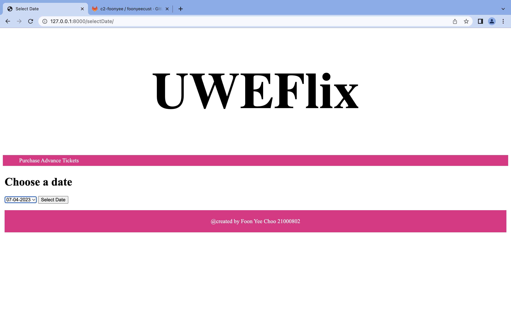
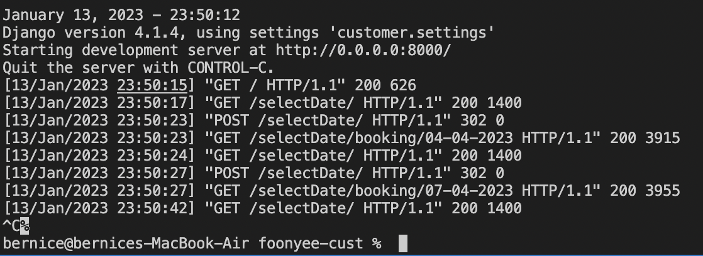

# UWEFlix

Click on the following to the each sub-header:-  
[How to Run](#how-to-run)<br />
[CRUD Operators](#crud-operators)<br />

## How to Run
1) Make sure the project is opened as directory in VSCode terminal
if you downloaded the .zip folder it should be ../foonyeecust

2) Run this line in the VSCode terminal to build image based from the Dockerfile
```
docker build -t desdcustomerslim:1.0 .
``` 

3) Run this line to start/run the container
```
docker run -p 8000:8000 desdcustomerslim:1.0
```

4) copy and paste the below to the web browser
```
127.0.0.1:8000
```
This is how it will look on a web brower:-


## CRUD Operators


